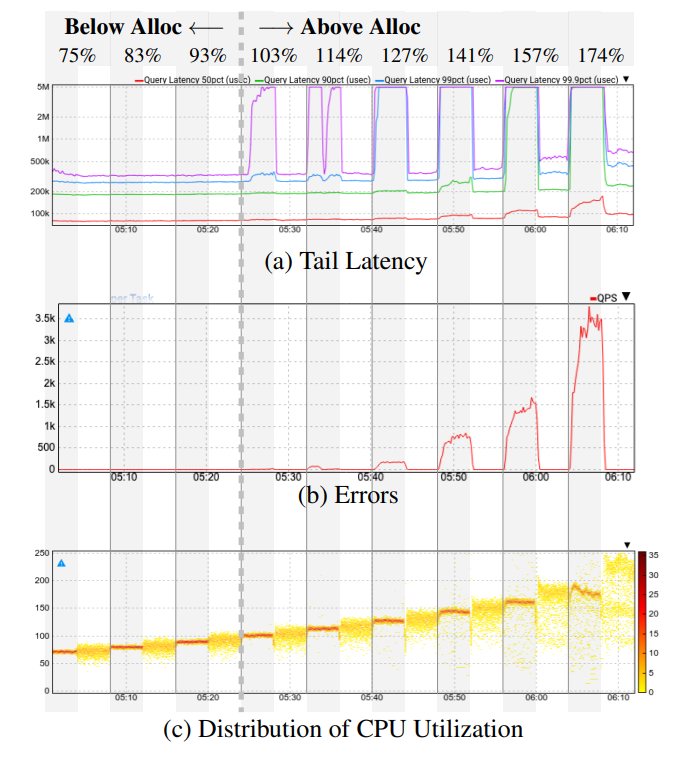
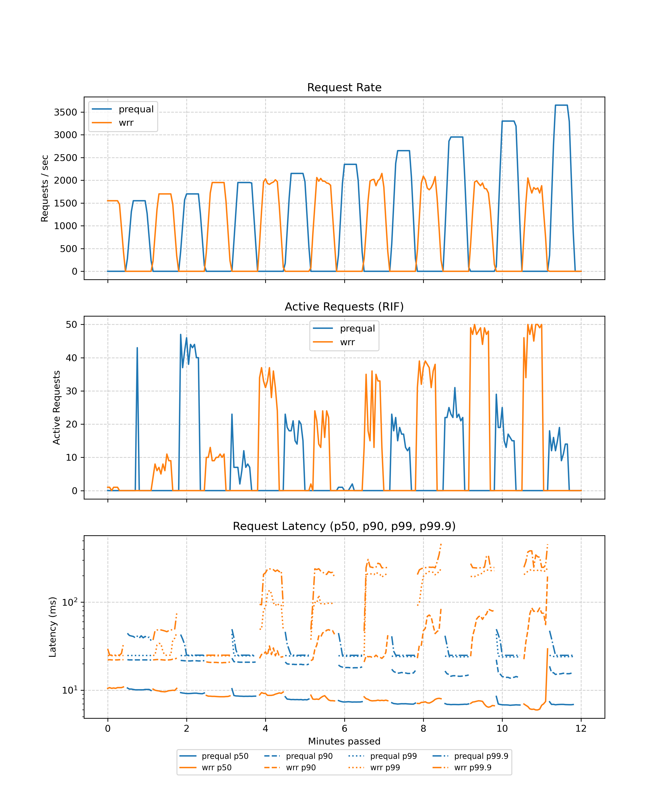
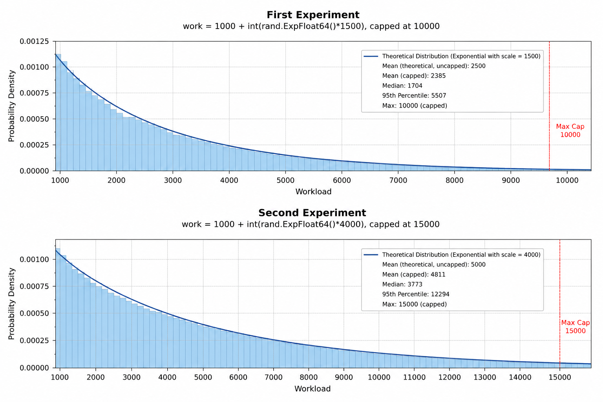
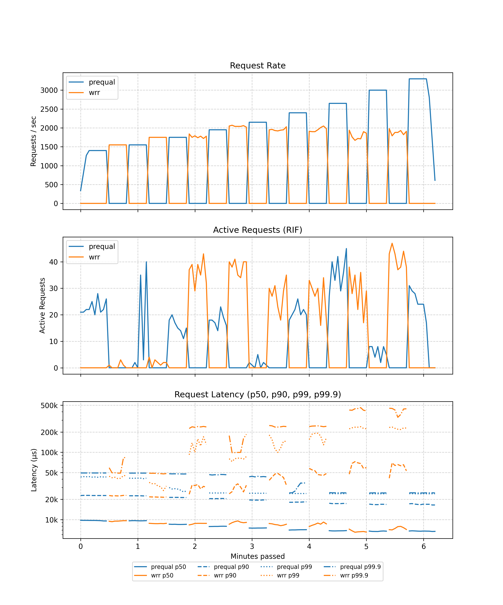
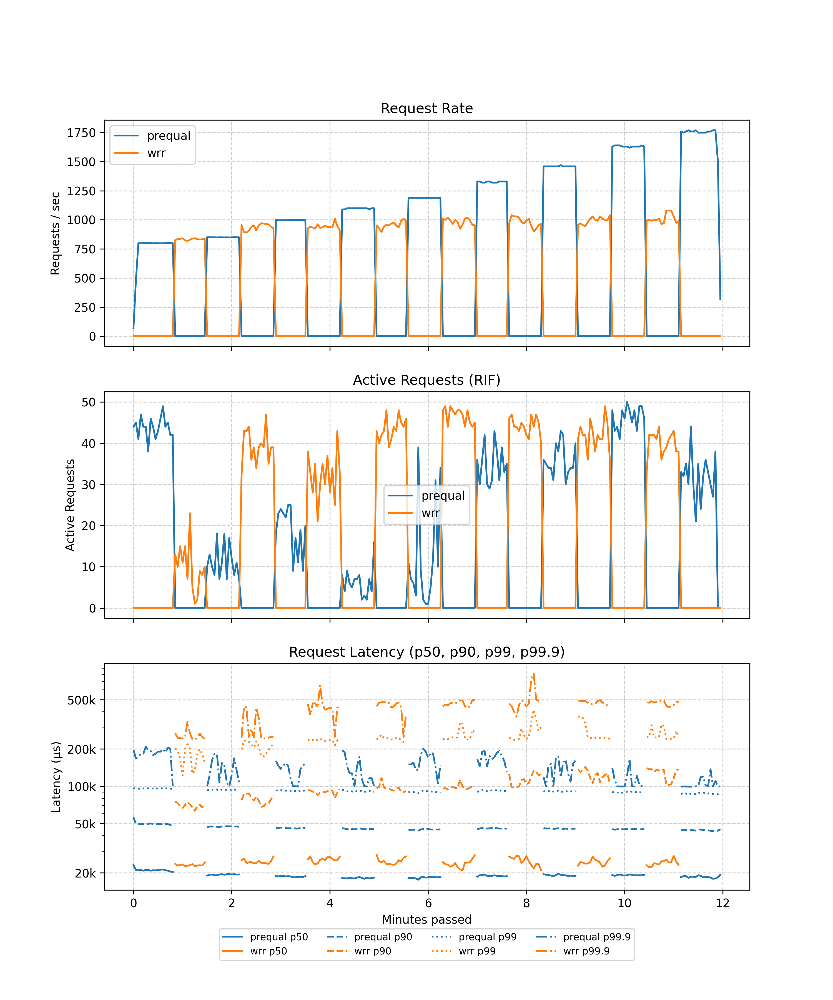
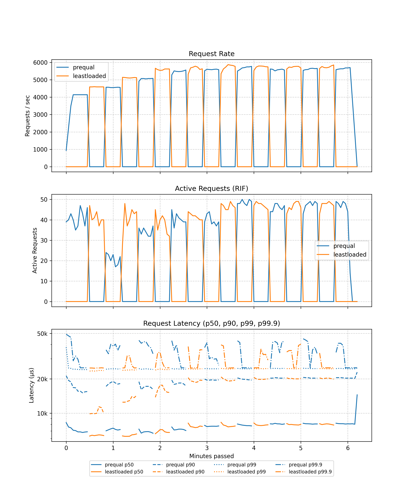

# Replicating: "The Title of Paper You Selected From The List"

**Team Members:**  
Sebastiano Perni (sebastiano.perni@mail.polimi.it);  
Dmitrii Meshcheriakov (email address);  
Paolo Salvi (paolo3.salvi@mail.polimi.it)

---

**Source Paper:**
Bartek Wydrowski, Google Research; Robert Kleinberg, Google Research and Cornell;
Stephen M. Rumble, Google (YouTube); Aaron Archer, Google Research
: Load is not what you should balance: Introducing Prequal. In Proceedings of the 21st USENIX Symposium on Networked Systems Design and Implementation (2024). Published by USENIX NSDI.


**Project:**
- Link to the GitHub repository: https://github.com/sebastiano-perni/loadbalancer

---

# 1. Introduction

Introduce the paper by summarizing:

## The problem the paper addresses and its importance
In big, multi-tenant datacenters loadbalancers typically distribute a huge amount of queries across vast pools of server replicas. The usual load balncing policy used at YouTube, Google and in many other companies is the WRR (Weighted Round Robin), which focuses on balancing CPU utilization across distributed servers in a single job.
However, this paper demonstrates that load is not what you should balance.Infact, focusing on CPU utilization as a primary metric backfires in modern infrastructure due to two critical flaws:
- CPU utilization must be averaged over a time window to be meaningful, so it's not able to detect sudden load shifts. Taking as reference some examples of metrics from the Youtube servers, looking at 1 minute time intervals we a good level of stability of CPU utlization across all the server replicas. While of we look at 1 second time intervals we can see greater underlying variability in the signal, with frequent bursts up to nearly twice the limit.


- Replicas share the hardware with unknown antagonist processes, thus even if the load of a service we want to balance is quite stable, the load on each machine can be greatky variable according also to the load of the antagonists. In case of a spike in the demand of the service, available machines can differ greatly in the capacity of absorbing additional load. Since this availability capacity depends also on the antagonists it cannot be predicted in advance but just detected at runtime. In case of heavy load, WRR can trigger disastrous spikes in tail latency and localized timeouts.


## The key ideas behind its solution and its approach
To overcome the limitations of WRR and similar algorithms, the authors introduce Prequal, which stands for Probing to Reduce Queuing and Latency, a loadbalancing policy designed to reduce the tail latency in multi-tenant datacenters.
Since CPU utilization is not accurate, Prequal use two load signals, RIF (Request in Flight) and latency.
The system exploits the power of d choices paradigm, which consists in  sampling d ≥ 2 servers for their load and sending the next request to the least loaded one.
Prequal categorizes server in hot and cold pool, relative to an estimated RIF distribution quantile. If the entire pool is hot, it picks the server with the absolute lowest RIF to protect hard RAM boundaries. Otherwise, it picks the cold server with the lowest estimated latency.
In order to achieve a succesful result, the design goals of prequal are:
- The minimization of probing overheads.
- Asynchronous probing to add minimal latency.
- Minimization of tail latency thanks to the removal of the worst probes.
- Limitation of RAM footprint of query processing on server replicas.


## The main contributions
- The distinction between hot and cold servers, which guarantees a better load assignment thanks to dynamic classificationGlobalConnect.
- The asynchronous probing system that keeps load metric fresh without adding delay to queries.
- An efficient management of the pools. Prequal alternates between removing the oldest probes and removing the worst probes. This ensures that the average quality of the pool does not degrade over time.

# 2. Selected Result

Mention which result of the paper you are reproducing, and explain its importance.


The main result of the paper we would like to reproduce is the comparison between Prequal and WRR in the case of a multi-server system. In particular we would like to highlight the differences in the tail latency, the rate of requests and their latency for both the algorithms.
To properly evaluate the behavior of the system, we reproduce the load ramp experiment. The aggregate CPU load begins at 75% of the allocation and is incrementally raised in 8 multiplicative steps of 10/9. This progression yields the following specific load levels: 0.75x, 0.83x, 0.93x, 1.03x, 1.14x, 1.27x, 1.41x, 1.57x, and 1.74x of the allocated CPU.

Particular attention is given to the behaviour of the system at peak load and at the tail latency. This is important because one of the primary aim of Prequal is to reduce tail latency and error rates, to allow production systems (such as Youtube) to run at much higher utilization than what could be reached with other types of algorithms. Therefore we expect that, the after the percentage of CPU utilization exceed the 100%, the behaviour of the two algorithms diverge, in particular looking at the latency of the last percentiles, as is possible to observe in Figure 1.


<div style="text-align: center;">
  
  <p>Figure 1: This graphs shows the improvement in tail latency achieved in using Prequal compared to WRR (figure 6 of the original paper)</p>
</div>

# 3. Environment Setup

## Hardware Environment

The experiment has been conducted on the CloudLab platform, using the Utah cluster. More specifically, we used 14 m510
nodes, each with an Intel Xeon D-1548 CPU (8 cores, 16 threads) and 64 GB of RAM. Of the 14 nodes, 1 was used as a load
generator, 1 as a telemetry server (running Prometheus and Grafana), 2 as load balancers, and the remaining ones as
backend servers.

## Software Environment

The experiment is based on a fork of the provided Prequal codebase, which is available at
this [link](https://github.com/omarshaarawi/loadbalancer). The forked repository adds the necessary scripts for running
the experiment and collecting results, as well as code for the further exploration described in section 5.

The software environment is based on Ubuntu 22.04. The included scripts install the following dependencies:

- Go 1.24.1
- Docker (latest version)
- Prometheus (latest Docker image)
- Grafana (latest Docker image)
- Utility tools: wget, curl, git, bc, hey, stress-ng

## Configuration Parameters

The CloudLab profile allows the following parameters to be configured:

- Number of backend servers (default: 10)
- Type of backend servers (default: m510)

The setup scripts allow the following parameters to be configured:

- Number of antagonist servers (default: 3)
- Load of antagonist servers (default: 60% CPU utilization with stress-ng)
- Duration of the load test (default: 180 seconds per phase)

## Deviations from the Original Setup

- **Deviation:** The paper evaluates Prequal on YouTube's production infrastructure, which consists of thousands of
  heterogeneous machines with organic, unpredictable background antagonist workloads. This experiment instead uses a
  10-node CloudLab cluster, simulating antagonists via stress-ng on a fixed subset of nodes.

  **Motivation:** Reproducing the Google environment is infeasible. Our simplified environment provides enough
  statistical evidence to demonstrate Prequal's effectiveness.

- **Deviation:** Prequal's original design implements an asynchronous, bounded probe pool of size 16 with advanced
  eviction rules (age, reuse limit, and highest load) to decouple probing from the critical path and maintain O(1)
  overhead. This experiment instead uses a background timer that synchronously polls all N servers and updates a global
  map.

  **Motivation:** While O(N) probing is problematic in datacenters due to massive scale, in our micro-cluster of 10
  nodes, the overhead is negligible and the implementation is simpler.

- **Deviation:** Prequal's original design calculates the "hot/cold" threshold (Q_RIF) based on an estimated global
  distribution of RIF across all replicas and estimates request latency using the median latency of requests that
  arrived at a similar RIF level. This experiment instead compares only d=2 servers, classifies them as hot/cold, and
  estimates latency via a /health endpoint.

  **Motivation:** While the original design is necessary for large-scale datacenters, our simplified implementation with
  10 nodes is enough to demonstrate Prequal's effectiveness.

# 4. Experiment Result

> Explain how your experiment was conducted and then what results you acquired.
> Afterwards, compare your results with those of the paper and state your
> takeaways.

Step-by-step description:

We first started by trying the artifact on our computers to understand if the one provided to us actually worked. Thus,
the initial steps were:

- cloning the repository on our computers,
- understanding how to launch the program,
- exploring which tools are used for metric analysis,
- and installing some libraries required by the artifact.

In fact, we discovered that the artifact uses Grafana and Prometheus for profiling.

The second step was understanding how we could reserve nodes on CloudLab to run our experiment. We completed the
registration steps to gain access to CloudLab and tried to reserve 3 servers. Two members of our group encountered
issues with the SSH protocol and couldn't connect to the reserved servers. The problem was that the SSH keys used were
based on the `id_ed25519` algorithm, but CloudLab required the `rsa` algorithm. At the same time, we configured CloudLab
to automatically upload and set up our forked artifact on its servers. We tried using a Python script to automate the
CloudLab setup, but we ran into issues where it occasionally would not execute as expected.

## Setup Procedure
IMPORTANT: All scripts must be executed from the "client" node.
Connect via SSH to the "client" node (copying the command from CloudLab).
Navigate to the repository directory:
```
cd /local/repository
```
Execute the "initial_setup" script:
```
sudo ./initial_setup.sh
```
Execute the "start_cluster" script:
```
sudo ./start_cluster.sh 
```
Where  can be either roundrobin or wrr.
Now all nodes should be online.
Running the Workload
Execute the run_test script with the same arguments you would use for the compare script:
```
./run_test.sh --duration 180
```
Accessing Grafana
Connect via SSH with localhost port forwarding to the "telemetry" node:
```
ssh -L 3000:localhost:3000 @
```
Note: The @ string matches the one found on CloudLab for the "telemetry" node (removing the "ssh" prefix).
You should now be able to access Grafana from your browser by navigating to: http://localhost:3000
NOTE: Grafana only displays data when there is active traffic. If you access Grafana before running the workload, the dashboard will appear empty.
Teardown / Closing
When you want to stop everything that was launched by start_cluster, simply run:
```
sudo ./stop_cluster.sh
```
This closes and resets the session (IT ALSO REMOVES ANY ACCUMULATED DATA).
Synchronizing Changes
If you make a change that needs to be shared across all nodes, you can apply the change on the "client" node and then run the sync script:
```
sudo ./sync.sh
```
The modification can be done locally, or it could have been pushed to GitHub. In the latter case, simply perform a git pull on the "client" node before running the sync script.
Troubleshooting
Permission Failures: If execution fails due to permissions, you might have forgotten to use sudo.
Missing Dependencies: If execution fails because of missing dependencies like Go, Hey, Docker, etc., try installing them manually on the respective nodes.
Grafana fails to close after stop_cluster: The container on the "telemetry" node might not have stopped. In this case, connect to that node via SSH and check for running containers using:
```
sudo docker ps
```
If containers are still running, you must stop and remove them manually:
```
sudo docker stop repository-grafana-1
sudo docker rm repository-grafana-1
```
Repeat this process for Prometheus if necessary.
Browser connection to Grafana fails:
You might have used the wrong port.
Try waiting for about thirty seconds.
You might have established the SSH tunnel with localhost to the wrong node.

## Next steps
The original artifact compared Prequal to Round Robin Balancing, while the paper compares Prequal to WRR. Thus, we had
to change the balancer code in order to implement WRR.

The next step was to launch the artifact and see if it worked in a multi-server environment. Due to how the original
artifact was set up, we had to modify the `docker-compose` configuration and create a few scripts to deploy the
infrastructure according to our requirements. When setting up the servers using our `start_cluster.sh` script, you can
specify which load-balancing algorithm you want to use.

After testing a configuration of 14 servers (1 client, 1 telemetry, 2 load balancers, and 10 servers) and verifying that
the servers were visible in Grafana, we started collecting data on Prequal vs. WRR metrics. We obtained the following
results:

<div style="text-align: center;">
  
  <p>Figure 2: Prequal VS WRR at 2500 fixed cycles</p>
</div>

As we can see from the figure, Prequal and WRR perform very similarly at load levels below 100%, where there is enough
free CPU to absorb the variance. However, as the load increases, WRR starts to struggle with tail latency, while Prequal
continues to maintain much better performance. This aligns with the results of the paper, which shows that WRR's focus
on CPU utilization leads to severe penalties for unlucky servers, while Prequal's approach of balancing based on RIF and
latency allows it to better manage such conditions.
1. Execution procedure
1. Measurement method (Grafana, Prometheus)
1. Number of runs
1. Statistical treatment (mean, median, CI, etc.)

Also Describe:

- How did you ensure correctness (did you check also other metrics to make sure the experiment is running correctly?)
- Did you do any debugging? Discuss issues you faced and how you overcame them (if applicable consider allocating a
  subsection for this item)
  (Grafana + Prometheus, Script for installing stuff on the servers (SUDO, ...),  )
  Changes from the original REPO:
  Script for running
  Load
  Split in two phases
  Bug in the computation of the baseline

Share your result and compare them with the paper's. Then discuss your takeaways.

For comparison include:

- Graph(s) or table(s)
- Matching axes and units with the source paper
- Error bars if applicable
- You may want to report difference with the original results (e.g., absolute
  number or percentage).

For example:


> **Reminder:** the goal is not achieve the exact results of the paper, but to do a rigorous experiment with similar
> assumptions from the source paper and gain insight. The insight can be correctness of work, failure to reproduce same
> results, or even infeasibility of doing such experiment for interesting reasons.

# 5. Further Exploration

In this project you are required to also explore a research question of your own. Either:

1. Take the same test with different input workload or a variation of a test that is not present in the paper and comment the results you obtain
1. Implement a new feature on top of the system you evaluated and show a figure showing the performance

Discuss which approach you take, and what you explored. Explain what was your
motivation and importance of your question.

In the original paper the workload is fixed, while in the original artifact the workload difference between two requests can be at maximum 50% with an average of 25%. Thus, we questioned ourselves about what could happen with a type of workload which is extremely heterogenous in both WRR and Prequal.


What we expect is to see worst performances on tail latency by WRR, since the unlucky servers to which are assigned particularly heavy requests will be extremely penalized. While for average latency we don't expext significative variations.

## 5.1. Methodology and Result

Report the experiment you designed for answering the question and share the
result you got.

Include:

- Graph(s) or table(s)
- How the experiment was conducted (share the details)
- What did you discover?

In practice the workload is assigned in this way:

Original artifact:
```
work = 1000 + rand.IntN(501)
```

Paper:
```
work = 2500
```

First experiment (moderate heterogeneity):
```
if work == 0 {
			work = 1000 + int(rand.ExpFloat64()*1500)
			if work > 10000 {
				work = 10000
			}
		}
```

Second experiment (extreme eterogeneity):
```
if work == 0 {
			work = 1000 + int(rand.ExpFloat64()*4000)
			if work > 15000 {
				work = 15000
			}
		}
```

Note that the work correspond to the execution of a SHA 256 algorithm.
The difference between the baseline, the first experiment, and the second experiment is the introduction of a highly variable workload heavily distributed towards the tail. This simulates a real-world scenario where a few requests demand disproportionately high CPU time, as shown in Figure 3.

<div style="text-align: center;">
  
  <p>Figure 3: Comparison between the distribution of the workloads used in the two experiments</p>
</div>

The experimental results powerfully reaffirm Prequal's effectiveness in managing tail latency, particularly under unpredictable load conditions.
As it's possible to see in the figures below, Prequal always outperforms or equalize WRR in basically every metric measured (Request latency, Active requests, Request rate) for each percentile considered and at every workload level.

- **Moderate heterogeneity**:
When moderate variability is introduced (Figure 4), the divergence between the two policies becomes starker. While WRR maintains acceptable p50 latencies at lower loads, its p99 and p99.9 latencies become highly erratic, jumping unpredictably. This occurs because unlucky servers assigned to heavy requests are aggressively penalized by WRR's strict CPU-balancing logic. Prequal continues to absorb the variance smoothly, though we begin to see its own p99.9 latency fluctuate slightly earlier in the load progression than in the baseline test.


- **Extreme heterogeneity**:
The final test with extreme variability (Figure 5) exposes the fundamental flaw of balancing on CPU utilization rather than instantaneous load.
While in the case of fixed load or slightly variable load WRR shows a good latency in the 99th percentile (comparable, if not equal to the one reported by Prequal) in case of low loads, in the case of highly variable distribution of load between requests, WRR struggles immediately, reporting a latency that is more than 50% bigger than the one reported by Prequal and hitting instantly the 50 RIF ceiling .
Also Prequal starts to struggle with the latency of the 99th percentile at heavy loads, while for fixed and slightly variable worloads the behaviour is constant, in the case of highly variable requests its behaviour tend to be very fluctuating with sudden peaks and unpredictable performances.


<div style="text-align: center;">
  
  <p>Figure 4: Results obtained in the test with exponential load with 2500 of mean and cap at 10000</p>
</div>

<div style="text-align: center;">
  
  <p>Figure 5: Results obtained in the test with exponential load with 5000 of mean and cap at 15000</p>
</div>

## 5.2. Evaluating the Least Loaded Algorithm

In addition to evaluating heterogeneous workloads, we also conducted an experiment to compare Prequal against the Least Loaded algorithm. According to the original paper, while the Least Loaded policy generally performs better than WRR, it still lags significantly behind Prequal, especially at high load levels. However, as illustrated in our experimental results, we observed a very different behavior. In our setup, Least Loaded achieved performance metrics that were remarkably similar to Prequal across all percentiles. In fact, under certain load steps, Least Loaded occasionally exhibited slightly better tail latency than Prequal.

<div style="text-align: center;">
  
  <p>Figure 6: Results obtained comparing Prequal and the Least Loaded algorithm</p>
</div>

This unexpected parity is not indicative of Prequal's structural equivalence to Least Loaded, but rather points to an infrastructural limitation in our test environment. Specifically, we encountered a CPU bottleneck on the load balancer node itself. The load balancer's CPU capacity maxed out before it could push enough traffic to fully saturate the backend servers. Because the backend servers never reached the critical load thresholds where Prequal typically provide the most significant benefits, Least Loaded appeared just as effective, if not better (maybe due to the added load). This represents an interesting failure to reproduce the paper's exact delta, highlighting that when evaluating advanced routing policies, the load balancer must be provisioned sufficiently to avoid masking the actual backend performance differences.

# 6. Reproducibility Assessment of the Paper

The paper's methodology was explained quite well at a high level, but it lacked the pseudocode necessary to easily
replicate it. Had we started the project without the provided artifact, implementing Prequal's logic would have been
significantly more difficult. Additionally, some plots lacked clear descriptions and required extra time to decipher.
The provided artifact itself was highly useful as a starting point for local testing and offered well-structured code.
While it worked smoothly on our personal computers, deploying it on CloudLab required crucial parameter tweaks and code
modifications, as it initially failed to capture packet information or performance metrics. Without these necessary
adjustments, evaluating the system's performance would have been impossible.

Reproducing the original findings was challenging at first glance, as our initial results did not match expectations.
However, after tuning the infrastructure, workload, and client configurations, we clearly confirmed the practical
outcomes presented in the paper. During this process, we also attempted to recreate the exact experiment described by
the authors, which featured 100 clients and 100 servers, each constrained to 10% of the machine's CPU. To achieve this,
we allocated 10 backend nodes on CloudLab and started 10 backend processes on each node, limiting their CPU usage based
on available cores. We then generated the workload using `hey` configured with 100 workers and an appropriate request
rate. Unfortunately, we could not reproduce the paper's results with this setup; the metrics showed extreme
inconsistency, and Prequal often underperformed compared to WRR. The most likely reason is that the load balancers were
being overloaded by the sheer volume of requests required to fill the capacity of 100 servers, hitting their CPU limits.
We tried addressing this by increasing the workload payload to saturate the backends, changing the number of `hey`
workers and their request rates, and testing different CPU limits, but the setup still did not behave as expected. While
we are not entirely sure of the exact cause, it is likely that multiple infrastructural bottlenecks were at play.

# 7. Conclusion

Conclude the report by mentioning the takeaways of experiments you did


Our project evaluated Prequal compared to the WRR algorithm in an environment made up of multiple servers. We succeded in reproducing the results obtained in the report regarding the tail latency, confirming that balancing requests based on requests in flight and latency is more effective than using CPU utilization as balancing metric, especially if we look at tail latency.

From our experiment and further explorations we also gathered the following takeaways:
- **Prequal is highly effective in situation of unpredictable loads:** While WRR can maintain acceptable median latencies under fixed or lightly variable loads, it severely penalizes unlucky servers when handling extreme heterogeneity.In fact, in our tests where the load was distributed with a negative exponential curve, WRR struggled immediately, while Prequal reported a better management of high heterogeneity.
- **Advanced load balancing policies could be ineffective if infrastructure is the bottleneck:** In our attempt to compare Prequal with the LeastLoaded algorithm the results returned unexpected parity between the two loadbalancing policies (while in the paper Prequal clearly performs better). The reason behind that is not a fault in our implementation of Prequal or an extremely version of the LeastLoaded algorithm, but a CPU bottleneck on our load balancer node which prevented the backend servers from reaching the critical load thresholds where Prequal usually outperforms the other algorithms.

  The same problem emerged even when we tried to reproduce the experiment using multiple virtual servers on the same physical machine. In that case WRR appeared to perform better, always due to a bottleneck in the CPU of the loadbalancer node.This demonstrates that while the underlying logic of Prequal is solid, adapting it requires careful architectural scaling to guarantee its benefits.

- **Reproducibility Challenges:** While the provided artifact was a starting point to test the behaviour of Prequal, the lack of pseudocode in the original paper made a coherent replication of the algorithm an hard challenge. Furthermore, deploying the artifact on CloudLab required significant configuration adjustments. Finally, since Prequal is designed specifically to mitigate instantaneous latency spikes, a critical role is also played by the monitoring tools (in our case Prometheus and Grafana), a correct configuration (for example setting a correct sampling interval) and a cleaning of the output data (given that Grafana relies on moving average) is essential to analyze correctly the behaviour of the load balancing algorithms over short time intervals.

---

# Appendix

You are asked to write this report using Markdown. You can find a cheat sheet
of Markdown syntax at this [link](https://rust-lang.github.io/mdBook/format/markdown.html).

For generating a PDF file from your report you can use a tool of your choice.
*md2pdf* is one such tool. See this [link](https://pypi.org/project/md2pdf/)
for more information about it. You can also use an online editor such as [this](https://www.md2pdf.io/).

